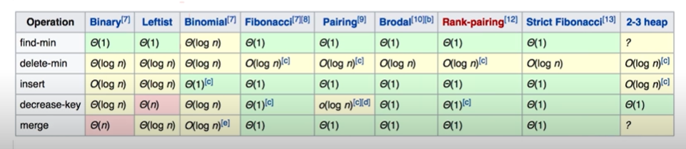

# 队列的基本操作
## 普通队列的 C++ 实现
```c++
#include <queue>
queue<int> q;
q.push(val);// 入队
int res = q.front();// 返回队首元素
q.pop();// 出队，不返回元素
```

### 用队列实现堆(Leetcode225)
- 只用一个队列便可实现
- 思路：入队时，让队尾元素出现在队首

## 优先队列
- 本质:堆
- c++ 实现
```c++
#include <queue>
#include <functional>
#include <vector>
// 大顶堆(默认)
priority_queue<int> max_heap;
// 小顶堆
priority_queue<int,vector<int>,greater<int>> min_heap;
```
- 时间复杂度

### 求数据流中的第K大的数(Leetcode703)
- 思路：构造节点数为k的小顶堆，堆顶元素就是第k大的元素
